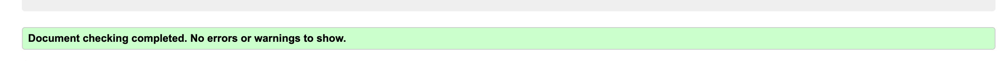

# Capture Photo Studio

Capture Photo Studio's site hopes to provide clients a space, wherever that may be, to create lasting memories and capture special moments that are, often times, missed. We hope to draw attention to the irony of constantly taking photos, but missing meaningful moments by not allowing ourselves to be present. Our dedicated team is here to ensure those special moments are captured and cherished for lifetimes. 

The site will be targeted toward people who want to book a photo shoot and keep memories safe through photography. The site will help people navigate through our services, gallery portfolio and contact us for more information.

## User Experience (UX)

- ### User Stories:
	- As a first-time user:
		- I want to be able to see their work in order to know if they offer good services.
		- I want to se testimonials from previous clients to see if the feedback is positive.
		- I want to be able to contact them to book a session or ask further questions.
	
	- As a returning visitor:
		- I want to be able to navigate to further social media sites to see more work and reviews of the company.
		- I want to easily find a way to contact the business- if I haven’t already.
		- I want to see the business location in proximity to me.

	- As a frequent visitor:
		- I want to be able to keep in touch with the business “Sign up to our newsletter”
		- I want to be able to post a review after having a successful session with them (Trustpilot)

- ### Design:
	- Color Scheme :
	
	- Tenor Sans is the main font used throughout the site with Verdanna being the fallback font, in case there are issues with the font working correctly on different browsers. Tenor Sans offers the user a simple and clean read while drawing their attention with sharp lines.
	- Imagery is key, as this is a photographers website. The images chosen are designed to be eye-catching and show the strengths of the business' success. Modern, moody and simple.

- ### Wireframe:
	- 	The final product is a variable of the below original wireframe.

    

## Features

### Existing Features:

- Navigation Menu
	- The navigation menu appears on all three pages and is a fully responsive bar that can direct you to the About, Gallery and Contact pages. The style remains the same on all pages for easy navigation.
	- The navigation menu section allows the user to navigate between pages without using the “back” button.
	- This menu is responsive on different screen sizes and allows the menu to shrink on mobile view to allow more screen space for the user.

- Main, About page image
	- This image is central to the screen to draw the users focus to the dramatic, eye-catching style. The image offers them a better sense of the quality of business offered and urges the user to keep scrolling for more content.

- About Us section
	- The about us section remains simple and short to keep the users attention just long enough to learn a little bit more about the business. Simplicity is key to keep users active on the site.

- Moments to Capture section
	- This section of information provides a brief snippet of the services offered by the business.
	- The content remains structured enough to grasp the attention of users who may not know what type of photography they are looking for, but allows users to understand many other options are available to those creative minds.

- Testimonials
	- The testimonials section exists to showcase the skills of the business through the eyes of previous user and their reviews. 
	- This section should encourage the user to continue through the site further, after seeing proof of the business’ quality of work.

- Google Maps
	- This map offers the location of the business to draw clientele in the surrounding areas.
	- This section exists to remove any questions of the availability of the business in regards to location.

- Foooter
	- The footer section allows the user to visit the business’ social media sites through use of links.
	- These links will open in a new window to allow the user to continue navigating through the site without using the back button.
	- The footer remains the same on all pages to keep the social media links easy to find.
	- The footer hopes to connect the business with more users and clients via social media sites.

- Gallery
	- The gallery will supply the user with a portion of the business’ portfolio of photography. 
	- The layout and style created on the page will encourage users to pause and take their time on each image.
	- This section allows the user to see the quality of work and types of photography that are available to them.

- Contact page image
	- The top of the contact page is designed to capture the attention of the user and set a bright tone for the user as they near the end of their visit to the website.
	- This section will lift the users spirits to be more willing to submit contact information and get in touch to book a photography session.

- Contact form details section
	- This form allows the user to enter details for the business to contact them. 
	- Use of placeholder text and required fields provides the user easy navigation through the form so that any questions about entering details is eliminated.

- Sessions to book section
	- This section allows the user to easily navigate through checkboxes for simplicity of submitting a form.
	- This section offers the business insight to the type of photography a user may be looking for. 
	- The sign up checkbox allows the user one extra option to stay in touch with the business. The newsletter should give the user another look at the business’ work for extra views and chances of a booking being queried and scheduled.

## Testing

This site’s accessibility was tested using Lighthouse in DevTools and received high performance and accessibility.

All navigation links were tested to ensure there were no breaks to hinder the usability of links. All text input areas and submission forms were tested to ensure forms are submitted correctly and require accurate information from users.

### Validator Testing
- HTML
	- No errors were found when passing through the W3C Validator.

- CSS
	- No errors were found when passing through the W3C CSS Validator.
	

## Deployment

This site was deployed to GitHub pages.
- Steps taken to deploy:
	- In the GitHub repository, navigate to the “Settings” tab
	- Select “Pages”
	- Set “Source” to ‘Deploy from Branch’
	- Save branch
	- Reload page once updated
	- Click on deployed github-pages link in the right-hand side of the “Code” page.

The live link to this site can be found here - https://morganoleary.github.io/Capture/index.html

## Credits

When needing assistance with this project, I was able to get support from peers on the Slack platform. My mentor was a great help in making sure I had all of the project’s criteria covered and provided study materials for any questions I had.

- Content
	- The color palette was generated using Adobe Color
	- The text for this site was created by myself
	- Instructions on how to implement the responsive hamburger menu on mobile views was learned from (https://www.youtube.com/watch?v=8QKOaTYvYUA&t=51s)
	- Code Institutes “Love Running” website was referenced when setting up the structure of the gallery page.

- Media
	- All photos used throughout the site were sourced from (https://www.pexels.com/)
	- Images were resized using (https://biteable.com/tools/image-resizer/) and converted to webp format using (https://tinypng.com/).

### Technologies Used

- Languages Used: HTML, CSS
- Programs Used: Balsamiq, Google fonts, Font Awesome, Adobe Color, Git, GitHub, coolers.co, Adobe Express, biteable.com, tinypng.com, pixelied.com, cssgradient.io

